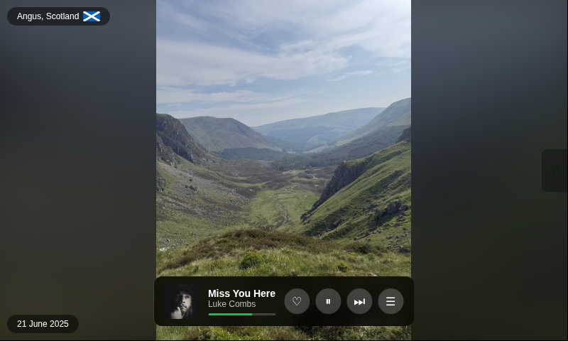

# PhotoVault

PhotoVault turns a Raspberry Pi 3B+ with a 7" DSI touchscreen into a photo frame that also shows what's playing on Spotify. It runs as a Flask app in Chromium kiosk mode. It can control TP-Link Tapo smart bulbs on the same network.



## What it does

The frame plays a fullscreen slideshow of photos synced from Google Drive via rclone. The app converts HEIC files to JPEG on the fly and caches them. It reads EXIF GPS from each photo and asks Nominatim for a place name. The app caches geocoding results locally to respect Nominatim's one-request-per-second limit.

A Spotify overlay sits on top of the photo while music plays. It shows the current track over its album art with a progress bar underneath. Spotipy's `auth_manager` refreshes the OAuth token on every call, so the overlay keeps working between sessions.

The overlay offers four playback controls:

- Skip to the next track
- Pause and resume
- Save the current track to your library
- Adjust volume

Tapping the screen while music plays opens a five-track queue view.

A separate panel lists every TP-Link Tapo bulb on the network. Each bulb has a power toggle and a brightness slider. A row of colour swatches sits alongside them. A bulk control applies any change to every bulb at once.

The 7" touchscreen responds to four gestures:

- Swipe the left edge to change screen brightness.
- Swipe the right edge to change playback volume.
- Double tap to toggle the display on and off.
- Single tap to show the overlay, or the queue while playing.

A cron entry turns the backlight off overnight between 19:00 and 07:00.

All data paths default to directories under the repo root, so the install location is not hardcoded.

## Installing on a Pi

Clone the repo to `/home/<user>/photovault` and run the steps below. The first step creates a venv and installs Python dependencies. The remaining steps install and enable the systemd units. They also add cron entries for photo sync and the display schedule.

```bash
./install_venv.sh
cp .env.example .env       # fill in Spotify credentials

# Install systemd units
sudo cp systemd/photovault-kiosk.service /etc/systemd/system/
sudo cp systemd/photovault-brightness.service /etc/systemd/system/
sudo systemctl daemon-reload
sudo systemctl enable --now photovault-kiosk.service photovault-brightness.service

# Install cron entries
( crontab -l 2>/dev/null; \
  echo "*/30 * * * * $(pwd)/scripts/sync-photos.sh"; \
  echo "* * * * * $(pwd)/scripts/display-schedule.sh" \
) | crontab -
```

Visit `http://<pi>:5000` and click "Connect Spotify" once to authorise the integration.

## Google Drive sync

Configure rclone once with a remote named `gdrive` pointing at a folder called `PhotoFrame` in your Google Drive. The sync script handles everything after that, and cron calls it every half hour.

```bash
rclone config              # create remote "gdrive", type Google Drive
./scripts/sync-photos.sh   # run once manually for the first sync
```
