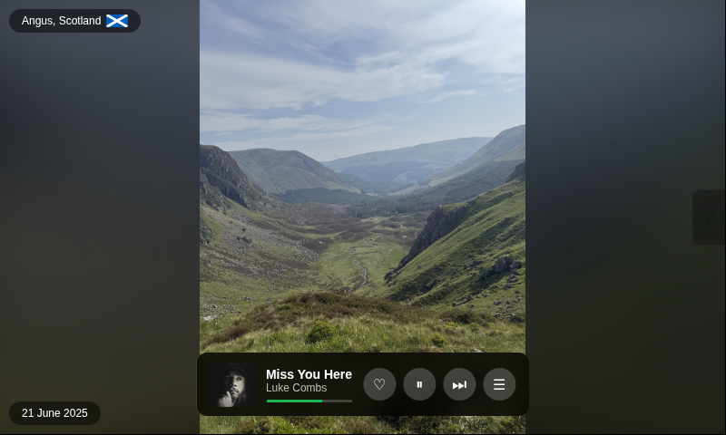
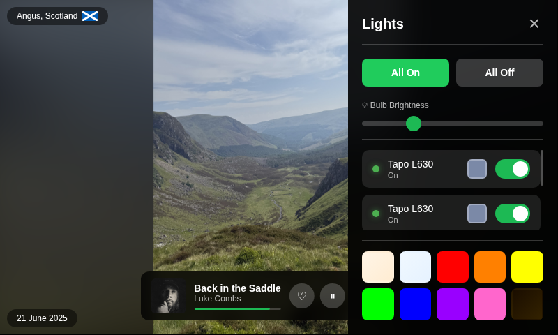

# PhotoVault

PhotoVault turns a Raspberry Pi 3B+ with a 7" DSI touchscreen into a photo frame that also shows what's playing on Spotify. It runs as a Flask app in Chromium kiosk mode. It can control TP-Link Tapo smart bulbs on the same network.




## What it does

The frame plays a fullscreen slideshow of photos synced from Google Drive via rclone. The app converts HEIC files to JPEG on the fly and caches them. It reads EXIF GPS from each photo and asks Nominatim for a place name. The app caches geocoding results locally to respect Nominatim's one-request-per-second limit.

A Spotify overlay sits on top of the photo while music plays. It shows the current track over its album art with a progress bar underneath. Spotipy's `auth_manager` refreshes the OAuth token on every call, so the overlay keeps working between sessions.

The overlay offers four playback controls:

- Skip to the next track
- Pause and resume
- Save the current track to your library
- Adjust volume

Tapping the screen while music plays opens a five-track queue view.

A separate panel lists every TP-Link Tapo bulb on the network. Each bulb has a power toggle and a brightness slider. A row of colour swatches sits alongside them. A bulk control applies any change to every bulb at once.

The 7" touchscreen responds to four gestures:

- Swipe the left edge to change screen brightness.
- Swipe the right edge to change playback volume.
- Double tap to toggle the display on and off.
- Single tap to show the overlay, or the queue while playing.

A cron entry turns the backlight off overnight between 19:00 and 07:00.

All data paths default to directories under the repo root, so the install location is not hardcoded.

## Installing on a Pi

Clone the repo to `/home/<user>/photovault` and run the steps below. The first step creates a venv and installs Python dependencies. The remaining steps install and enable the systemd units. They also add a cron entry for the display schedule.

```bash
./install_venv.sh
cp .env.example .env       # fill in Spotify credentials

# Install systemd units
sudo cp systemd/photovault-kiosk.service /etc/systemd/system/
sudo cp systemd/photovault-brightness.service /etc/systemd/system/
sudo cp systemd/photovault-sync.service /etc/systemd/system/
sudo systemctl daemon-reload
sudo systemctl enable --now photovault-kiosk.service photovault-brightness.service photovault-sync.service

# Install cron entry
( crontab -l 2>/dev/null; \
  echo "* * * * * $(pwd)/scripts/display-schedule.sh" \
) | crontab -
```

Visit `http://<pi>:5000` and click "Connect Spotify" once to authorise the integration.

## Google Drive sync

Configure rclone once with a remote named `gdrive` pointing at a folder called `PhotoFrame` in your Google Drive. The photovault-sync service watches that folder. Every minute it lists the remote, which is one cheap API call. It runs a full sync only when the listing changes, so new photos appear within about a minute of upload. Set `SYNC_POLL_INTERVAL` (seconds) or `SYNC_REMOTE` in the unit to override the defaults.

Once a photo's location is known from its EXIF GPS, the app moves it into a folder named after that location on Drive, for example `PhotoFrame/Fife, Scotland/`. A Live Photo instead goes into its own folder under the location, named after the photo, holding just the still and its clip, for example `PhotoFrame/North Berwick, Scotland/IMG_4446/`. Photos without GPS data stay at the root. Set `PHOTO_REMOTE` to override the remote the moves target.

```bash
rclone config              # create remote "gdrive", type Google Drive
./scripts/sync-photos.sh   # run once manually for the first sync
```

## Uploading from your phone

PhotoVault accepts photos sent straight from an iPhone. They land in the same Google Drive folder as everything else, so the frame picks them up on the next sync. An iOS Shortcut does the sending, because Safari cannot hand a Live Photo's video to a web page. The Shortcut reads both halves of a Live Photo and posts them together.

A page at `http://<pi>:5000/manage` curates the library from your phone. It shows every photo as a grid of previews. Each photo can be switched in or out of the slideshow, or deleted from Google Drive along with its clip. A photo switched off stays on Drive and can be switched back on later. The flags live in `photo_prefs.json` and key on each filename, so they survive the move into a location folder.

Two settings turn this on:

```bash
PHOTOVAULT_BIND_HOST=0.0.0.0   # put the app on the home network
PHOTOVAULT_PIN=your_pin_here   # guards every write from the network
```

The PIN guards uploads, the manage page, and the existing brightness, volume and bulb endpoints. Requests from the Pi itself skip it, so the kiosk keeps working untouched. With no PIN set, nothing off the Pi can write. Uploads reach Drive before they appear locally, because the sync deletes any local file that Drive does not hold.

See [docs/ios-upload-shortcut.md](docs/ios-upload-shortcut.md) for the Shortcut recipe and the manage page in detail.
